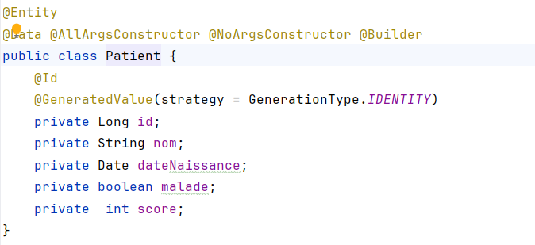
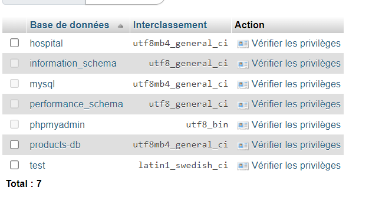

<h1> Compte Rendu </h1>
<h2 class="text-danger">Activité Pratique N°3 - Spring MVC</h2>

<h3>Objectif de l'application :</h3>

 - Afficher les patients

 -Faire la pagination 

 -Chercher les patients

 -Supprimer un patient

 -Faire des améliorations supplémentaires

<h3> Classe Patient</h3>

<h3> Patient  Repository </h3>

<h3> Patient Controller </h3>

<h3> Ajout des patients </h3>

<h3> Template html</h3>

<h3> Migration de H2 Database vers MySQL</h3>

properties:

la base de donnée Hospital dans mysql :

affichage de la liste des patients dans la base de donnée

<h3>la vue html</h3>

